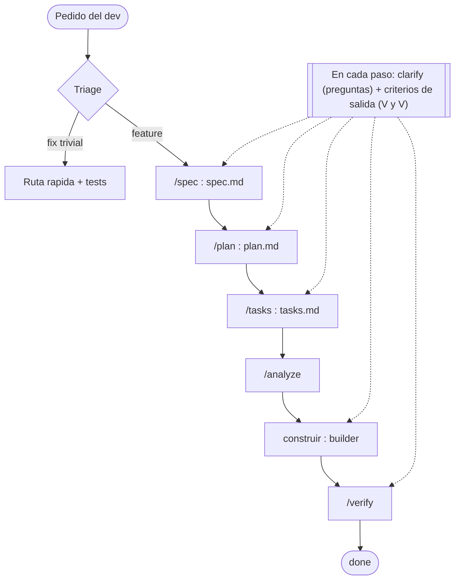

# `.claude/commands/`

Atajos invocables con `/<name>`. Markdown simple, sin la estructura tan elaborada de las skills.

## Cuándo crear un command (vs skill vs agente)

Elegí **command** cuando:

- La instrucción cabe en **5 líneas o menos** (o es un orquestador fino que delega).
- **No** necesitás restringir tools.
- **No** hay lógica de cobertura ni verificación propia (la delega).
- Es esencialmente un **alias** o template de prompt corto, o la **interfaz interactiva** de una fase.

Elegí **skill** (`.claude/skills/`) cuando el workflow crece: multi-fase con lógica propia, tools acotadas, o auto-trigger por descripción.

Elegí **agente** (`.claude/agents/`) cuando hace falta una sesión con su propio system-prompt, su propio set de tools y trabajo pesado aislado del hilo principal (exploración profunda, redacción, validación).

> Excepción deliberada: los comandos SDD son multi-fase porque son la **interfaz interactiva** del flujo. No hacen el trabajo pesado: son orquestadores finos que delegan en el agente que corresponde a cada fase.

## Nota sobre fases interactivas

`/spec` y `/contract` son **interactivos**: hacen un loop de `[VERIFICAR]` y no avanzan a `approved` hasta que vos respondas cada pregunta abierta. No los corras "a ciegas" esperando un resultado de una sola pasada.

## Frontmatter mínimo

```yaml
---
name: <kebab-case>
description: <una línea>
argument-hint: <opcional, ej: "[NNN-slug]">
---
```

## Convenciones

- Un archivo por command: `.claude/commands/<name>.md`.
- Nombre: kebab-case, idealmente verbo o verbo-objeto.
- Cuerpo: instrucción imperativa al modelo. Puede usar `$ARGUMENTS` para inyectar lo que el usuario pasó.

## Activos en este kit

Los **6 comandos** del flujo **Spec-Driven Development** (ver `specs/README.md`). Cada uno es la interfaz interactiva de una fase; delega el trabajo pesado a un agente de `.claude/agents/`.

| Comando | Fase | Agente que delega | Qué produce |
|---|---|---|---|
| `/spec [NNN-slug]` | Requisitos (Fase 0 des-ambiguación + QUÉ + criterios de aceptación) | `requirements-analyst` (+ `requirements-reviewer`) | `spec.md` |
| `/contract [NNN-slug]` | Contrato (la interfaz que exponés) — **OPCIONAL** | `solution-designer` | `contract.md` |
| `/plan [NNN-slug]` | Diseño (CÓMO) | `solution-designer` | `plan.md` |
| `/tasks [NNN-slug]` | Descomposición (checklist atómica) | — (hilo principal) | `tasks.md` |
| `/analyze [NNN-slug]` | Análisis (consistencia antes de codear) | `spec-analyst` | reporte de consistencia |
| `/verify [NNN-slug]` | Verify (Definition of Done — cada criterio con evidencia) | `validator` (+ `e2e-tester` OPCIONAL) | tabla AC×evidencia |

El flujo completo, de pedido a `done`:



## Comandos utilitarios

> Agregá comandos utilitarios propios de tu stack según los necesites — por ejemplo atajos de `{{BUILD_COMMAND}}`, `{{TEST_COMMAND}}` o `{{RUN_COMMAND}}`, o un comando que imprima `{{MIGRATION_COMMAND}}` sin ejecutarlo. Mantenelos cortos y de una sola responsabilidad.
