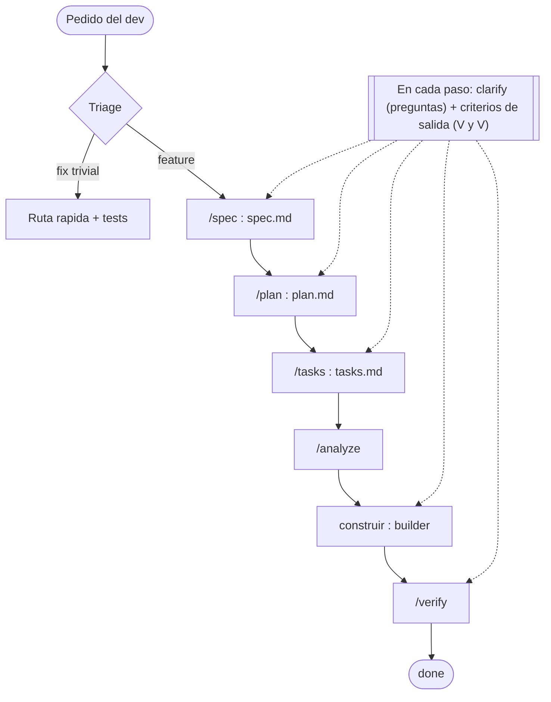

# agentic-sdlc

## Empezá acá → [`GETTING-STARTED.md`](./GETTING-STARTED.md)

Antes de tocar nada, leé `GETTING-STARTED.md`: te dice qué tres archivos rellenar, cómo barrer los placeholders y cómo hacer tu primera feature de punta a punta. El resto de este README es el mapa del kit.

---

**agentic-sdlc** es un template agnóstico de lenguaje y **sin código** para arrancar un proyecto nuevo —de cualquier tipo: API, librería, CLI, app, servicio, lo que sea— y empezar a trabajar con Claude/IA desde el día uno bajo un flujo de **Spec-Driven Development (SDD)**. No trae stack, ni framework, ni build: trae la **maquinaria de proceso** (comandos, agentes, hooks, plantillas de spec y reglas de gobernanza) ya cableada, con marcadores `{{TOKEN}}` y bloques `[EJEMPLO — reemplazar]` para que la adaptes a tu proyecto en una tarde.

El **pitch de SDD** en un párrafo: la **spec versionada en el repo es la fuente de verdad, no el prompt**. El prompt es efímero y se pierde; la spec queda en git, se revisa y se verifica. Cada **feature = una carpeta numerada** (`specs/NNN-slug/`) con su `spec.md` (comportamiento + **criterios de aceptación** verificables, true/false), su `plan.md` (el cómo) y su `tasks.md` (la checklist atómica). Y **nada está `done` hasta pasar `/verify`**, recorriendo cada criterio de aceptación uno por uno con **evidencia** (`archivo:línea` y/o comportamiento ejecutado real). Esto reemplaza el "escribo lo que quiero en un prompt y lo voy refinando": acá el detalle vive en un artefacto que se versiona, se discute y se cierra.

---

## El flujo en un vistazo

Todo pedido pasa por un **triage**: un fix trivial va por la ruta rápida (con sus tests); una feature recorre las fases SDD. En **cada** paso corre `clarify` (la IA pregunta antes de asumir) y se chequean los criterios de salida (V&V).



---

## Qué hay en el kit

La **maquinaria de IA** vive en `.claude/` (detalle en [`.claude/README.md`](./.claude/README.md)). Resumen:

| Tipo | Cuenta | Qué es |
|---|---|---|
| **Comandos** (`.claude/commands/`) | 6 | Un comando fino por fase del flujo (`/spec` `/plan` `/tasks` `/analyze` `/verify` `/contract`); cada uno delega en un agente. `/contract` es OPCIONAL. |
| **Agentes** (`.claude/agents/`) | 7 | Subagentes con rol profesional (analista, arquitecto, QA, ingeniero, V&V…) que ejecutan cada etapa con contexto aislado. |
| **Skills** (`.claude/skills/`) | 4 | Workflows estructurados: `bug-finder`, `validate-specs` (gate determinístico + CI), `setup` (onboarding), `clarify` (preguntas por fase). |
| **Hooks** (`.claude/hooks/`) | 2 | Guardas determinísticas que el harness corre en eventos: `block-forbidden-command` y `block-protected-file` (cada uno `.ps1` + `.sh`). |

---

## Este proyecto usa SDD

> **Si sos un asistente de IA (o una persona) que va a trabajar en un repo armado con este kit, leé en este orden:**
>
> 1. **`CLAUDE.md`** — el gate de comportamiento: clasifica cada pedido y decide si va por SDD o por ruta rápida.
> 2. **`AGENTS.md`** — los hechos técnicos del repo: stack, comandos, arquitectura, repo contracts.
> 3. **`specs/README.md`** — el proceso SDD canónico, fase por fase.
>
> Ante conflicto: en cuestiones de **proceso** gana `specs/README.md`; en cuestiones **técnicas** gana `AGENTS.md`; siempre gana la regla **más restrictiva** y, si persiste, se pregunta.

---

## Mapa de archivos del kit

```
agentic-sdlc/
├── README.md                 ← este archivo (landing del kit)
├── GETTING-STARTED.md        ← cómo adoptar el template — EMPEZÁ ACÁ
├── CLAUDE.md                 ← gate de COMPORTAMIENTO para Claude (triage SDD-first)
├── AGENTS.md                 ← HECHOS agnósticos de herramienta (stack, comandos, arquitectura, contratos) — autoridad técnica
├── .gitignore                ← ignora settings locales y basura de OS/editor
│
├── .claude/                  ← maquinaria de Claude Code (comandos, agentes, hooks…)
│   ├── settings.json         ← config committeada: registra los hooks (elegí runner PowerShell o POSIX)
│   ├── commands/             ← un comando fino por fase del flujo
│   │   ├── spec.md           ← /spec      → requirements-analyst + requirements-reviewer
│   │   ├── plan.md           ← /plan      → delega en solution-designer
│   │   ├── tasks.md          ← /tasks     → corre en el hilo principal (sin agente)
│   │   ├── analyze.md        ← /analyze   → delega en spec-analyst
│   │   ├── verify.md         ← /verify    → delega en validator (+ e2e-tester opcional)
│   │   ├── contract.md       ← /contract  → delega en solution-designer  (OPCIONAL)
│   │   └── README.md
│   ├── agents/               ← subagentes especializados (system-prompts)
│   │   ├── requirements-analyst.md   ← escribe la spec, exprime los [VERIFICAR]
│   │   ├── requirements-reviewer.md  ← V&V de requisitos / test de ambigüedad (read-only)
│   │   ├── solution-designer.md      ← diseña plan y contrato
│   │   ├── spec-analyst.md           ← chequea consistencia spec↔plan↔tasks
│   │   ├── validator.md              ← corre /verify contra cada criterio
│   │   ├── builder.md                ← implementa las tareas
│   │   ├── e2e-tester.md             ← valida end-to-end real   (OPCIONAL)
│   │   └── README.md
│   ├── skills/               ← skills reutilizables (workflows estructurados)
│   │   ├── bug-finder/SKILL.md       ← loop de búsqueda/convergencia de bugs
│   │   ├── validate-specs/SKILL.md   ← gate determinístico del proceso (+ scripts + CI)
│   │   ├── setup/SKILL.md            ← onboarding guiado (llena los 3 archivos obligatorios)
│   │   ├── clarify/SKILL.md          ← protocolo de preguntas en CADA fase
│   │   └── README.md
│   ├── rules/                ← reglas auxiliares enganchables
│   │   └── README.md
│   └── hooks/                ← scripts determinísticos que el harness corre en eventos
│       ├── block-forbidden-command.{ps1,sh}  ← bloquea un comando Bash prohibido (ej. {{MIGRATION_COMMAND}})
│       ├── block-protected-file.{ps1,sh}     ← bloquea Edit/Write a un archivo protegido (ej. {{SECRETS_FILE}})
│       └── README.md
│
└── specs/                    ← gobernanza y carpetas de features
    ├── README.md             ← PROCESO SDD canónico (gana ante conflicto de proceso)
    ├── CONSTITUTION.md       ← reglas no-negociables del proceso (§1 triage, §4 tus contratos duros)
    ├── GUIA-EQUIPO-SDD.md    ← instructivo paso a paso para el equipo
    ├── INDEX.md              ← catálogo de specs del repo y su estado
    ├── HALLAZGOS.md          ← inbox de bugs/dudas encontrados usando la app
    ├── TEMPLATE/             ← plantillas en blanco para copiar a cada feature
    │   ├── spec.md · plan.md · tasks.md
    │   └── contract.md       ← OPCIONAL — solo si exponés una interfaz
    └── 000-EXAMPLE-feature/  ← ejemplo lleno READ-ONLY (borralo cuando entiendas el flujo)
        └── spec.md · plan.md · tasks.md · contract.md
```

---

## Los comandos del flujo

Cada fase tiene un comando fino que delega en un agente especializado:

| Fase | Comando | Agente | Qué produce |
|---|---|---|---|
| Contrato *(OPCIONAL)* | `/contract` | `solution-designer` | `contract.md` — la forma de tu interfaz |
| Spec | `/spec` | `requirements-analyst` + `requirements-reviewer` | `spec.md` — el qué y el por qué + criterios de aceptación (con test de ambigüedad) |
| Plan | `/plan` | `solution-designer` | `plan.md` — el cómo, qué se reutiliza, riesgos |
| Tasks | `/tasks` | — (hilo principal) | `tasks.md` — checklist atómica atada a los criterios |
| Analyze | `/analyze` | `spec-analyst` | reporte de consistencia (antes de codear) |
| Verify | `/verify` | `validator` (+ `e2e-tester`) | cada criterio en ✅ con evidencia → `done` |

> Las fases marcadas **OPCIONAL** (`/contract`, `contract.md`, agente `e2e-tester`) solo aplican si tu proyecto expone una interfaz que otros consumen (API, librería, CLI, schema/formato). Si no, `GETTING-STARTED.md` te dice cómo borrarlas.

---

## Convenciones de placeholders (resumen)

| Marcador | Qué significa | Qué hacés |
|---|---|---|
| `{{TOKEN}}` | un valor que DEBÉS reemplazar (`{{PROYECTO}}`, `{{BUILD_COMMAND}}`, `{{TEST_COMMAND}}`, `{{RUN_COMMAND}}`, `{{SOURCE_ROOT}}`, `{{SECRETS_FILE}}`, `{{MIGRATION_COMMAND}}`) | buscar y reemplazar por el real |
| `[EJEMPLO — reemplazar]` | bloque ilustrativo que muestra la FORMA | editar o borrar |
| `[VERIFICAR]` | pregunta abierta que **bloquea** pasar a `approved` | resolver antes de aprobar la spec |

El detalle de cómo barrerlos está en `GETTING-STARTED.md`.

---

El kit está escrito en **español (rioplatense)** para toda la prosa humana; las keys de YAML, los enums de estado (`draft`/`approved`/`proposed`/`shipped`/`done`), la config y la jerga SDD van en inglés. Un equipo que prefiera trabajar en inglés puede traducir la prosa: la estructura es independiente del idioma.
