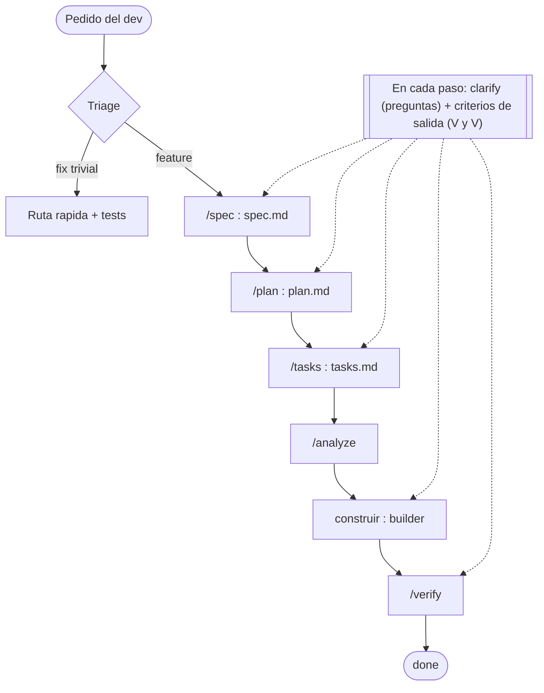

# Spec-Driven Development — Proceso canónico de {{PROYECTO}}

> **Este documento es el canónico del proceso SDD del repo.** Es la fuente de verdad del *proceso*: si algún otro doc (CLAUDE.md, AGENTS.md, GUIA-EQUIPO-SDD.md) entra en conflicto sobre **cómo se trabaja una feature**, gana este documento. Si este documento está mal, se corrige acá (no se bifurca).

Proceso por el que pasa **toda feature** de {{PROYECTO}}. La idea central:

> La spec versionada en el repo es la **fuente de verdad**, no el prompt. El detalle vive en `spec.md` (comportamiento + **criterios de aceptación verificables**) y —si tu proyecto expone una interfaz— en `contract.md`, y nada se da por terminado hasta recorrer los criterios uno por uno con `/verify`.

Esto reemplaza el patrón de "escribo lo que quiero en un prompt y lo voy refinando". El prompt es efímero y se pierde; la spec queda versionada, se revisa y se verifica.

---

## El flujo en un vistazo



---

## Lifecycle

`status` en el frontmatter de cada artefacto:

| Artefacto | Estados |
|---|---|
| `spec.md` | `draft` → `approved` → `in-progress` → `done` · (`superseded` con `superseded-by: NNN`) |
| `contract.md` *(OPCIONAL)* | `proposed` → `approved` → `shipped` |
| `plan.md` | `draft` → `approved` |

Semántica de los estados:

- `draft` — todavía hay preguntas abiertas (`[VERIFICAR]`). No se construye contra esto sin marcar los supuestos.
- `approved` — consensuado y estable. Recién acá se planea/construye en serio.
- `in-progress` — alguien está implementando las tareas.
- `done` — pasó `/verify` con **todos** los criterios de aceptación en ✅.
- `proposed` / `shipped` (solo `contract.md`) — el contrato se está diseñando / ya está implementado con evidencia `archivo:línea`.

El token de estado es **una sola palabra canónica**. Los matices van después de un guion: `shipped — falta deploy a prod`, nunca "shipped parcial" reusado con dos significados distintos.

---

## El flujo, fase por fase

Cada fase tiene un comando fino en `.claude/commands/`. El comando delega el trabajo pesado a un **agente** especializado en `.claude/agents/` (salvo `/tasks`, que corre en el hilo principal).

| # | Etapa SDLC | Fase | Comando | Agente | Aprueba |
|---|---|---|---|---|---|
| −1 | Intake | **Triage** | — (gate de `CLAUDE.md`) | — | — |
| 0 | Diseño (interfaz) | **Contrato** *(OPCIONAL)* | `/contract` | `solution-designer` | El dev/lead |
| 1 | Requerimiento + Análisis | **Spec** (Fase 0 + **Análisis del problema** §3 + criterios + V&V de requisitos) | `/spec` | `requirements-analyst` (redacta) + `requirements-reviewer` (test de ambigüedad) | Quien pide la feature |
| 2 | Análisis | **Clarify** (opcional) | `/spec` (re-corrida) | `requirements-analyst` | — |
| 3 | Diseño (interno) | **Plan** | `/plan` | `solution-designer` | El dev/lead |
| 4 | Construcción | **Tasks** | `/tasks` | — (hilo principal) | — |
| 5 | Análisis | **Analyze** | `/analyze` | `spec-analyst` | — |
| 6 | Construcción | **Implementar** | — | `builder` | — |
| 7 | Test y validación | **Verify** | `/verify` | `validator` (+ `e2e-tester` opcional) | El dev/lead |

**Regla de oro:** una feature no está `done` hasta pasar `/verify` con **todos** los criterios de aceptación en ✅. Y `/verify` no es solo tildar: actualiza el `INDEX.md` y cierra los hilos que correspondan (cierre del loop).

### −1. Intake / triage — antes de elegir fase
Entendé la intención del dev, clasificá el pedido (feature/cambio observable · fix trivial-mecánico · pregunta-exploración · ops/infra) y elegí ruta. Las señales canónicas viven en `CONSTITUTION.md §1`; el gate de comportamiento que decide está en `CLAUDE.md`. **Ante la duda, es SDD.**

### 0. `/contract` — la interfaz *(OPCIONAL)*
> **Solo si tu proyecto expone una interfaz que otros consumen** (API, librería, CLI, schema/formato de archivo). Si tu proyecto no expone nada hacia afuera, saltá esta fase y borrá `/contract`, el `TEMPLATE/contract.md` y el agente `e2e-tester` (ver `GETTING-STARTED.md`).

Genera/actualiza `specs/NNN-slug/contract.md` desde `TEMPLATE/contract.md`: la forma de la interfaz (firmas, campos, tipos, errores, estados, autorización, ¿migración de esquema/datos?). Status `proposed` hasta implementar y verificar, momento en el que pasa a `shipped` con evidencia `archivo:línea`.

### 1. `/spec` — QUÉ y POR QUÉ (con Fase 0 y V&V de requisitos)
Arranca con la **Fase 0 — investigación / des-ambiguación del pedido**: el `requirements-analyst` explora lo que ya existe, lista supuestos y ambigüedades del pedido y los resuelve con vos *antes* de redactar. Después genera `spec.md` —que incluye el **§3 Análisis del problema** (descomposición + modelo conceptual + impacto, el puente entre el QUÉ y el CÓMO antes de diseñar)— y **pregunta hasta que no quede ningún `[VERIFICAR]`**. Acá nacen los **criterios de aceptación**: afirmaciones verificables, true/false, no objetivos vagos. Antes de aprobar, el `requirements-reviewer` corre el **test de ambigüedad** (la V&V de requisitos): audita la spec buscando ambigüedad, supuestos ocultos, criterios no testeables y casos faltantes — el autor no se valida a sí mismo. No se escribe código. Cuando se cumplen los **criterios de salida** de la spec → `approved`, y se registra la fila en el `INDEX.md`.

### 2. Clarify (opcional, vía `/spec` re-corrida)
Si quedaron preguntas abiertas, se resuelven antes de planear. Sin ningún `[VERIFICAR]` pendiente → la spec pasa a `approved`. *(No existe un comando `/clarify`; es simplemente una re-corrida de `/spec` sobre la spec existente.)*

### 3. `/plan` — CÓMO
Genera `plan.md`: el enfoque técnico, qué se **reutiliza** (no duplicar lo que ya existe), los cambios archivo por archivo, los riesgos. Versionado. Lo aprobás vos.

### 4. `/tasks` — descomposición
`tasks.md`: una checklist atómica donde cada tarea está atada a un criterio de aceptación (columna "Cubre AC"). Incluye las tareas de test obligatorias. Corre en el hilo principal, sin agente.

### 5. `/analyze` — consistencia (antes de codear)
¿Cada criterio de aceptación tiene tareas que lo cubren? ¿El plan respeta el `contract.md` (si existe) y la `CONSTITUTION.md`? ¿Hay scope creep? Se corrige spec/plan/tasks **antes** de implementar, que es donde corregir es barato.

### 6. Implementación
Se ejecutan las tareas siguiendo `AGENTS.md` + `CLAUDE.md` + `CONSTITUTION.md`. **Se marca cada tarea en `tasks.md` al completarla** (no todas juntas al final): el `tasks.md` es el estado real del trabajo.

### 7. `/verify` — Definition of Done
Recorre **cada criterio de aceptación** con evidencia (`archivo:línea` y/o comportamiento en runtime). Corre los gates del proyecto: `{{BUILD_COMMAND}}`, `{{TEST_COMMAND}}` (y `e2e-tester` si hay contrato). Con todos los AC en ✅ → `status: done`; si hay contrato, pasa a `shipped`. Actualiza el `INDEX.md`.

---

## V&V en cada fase — el modelo en V (criterios de salida)

La verificación y validación **no es solo la fase final**: cada fase tiene su propia V&V — sus **criterios de salida** — que el ingeniero humano valida antes de avanzar. Atajar un defecto en su fase cuesta una fracción de atraparlo en `/verify`.

| Fase | Su V&V (criterios de salida) | Quién valida |
|---|---|---|
| 0 · Investigación | el pedido se entendió; 0 ambigüedades/supuestos sin resolver | humano |
| 1 · Requisitos (`spec.md`) | criterios testeables + cobertura (golden/borde/auth/persistencia) + **test de ambigüedad** del `requirements-reviewer` | humano |
| 2 · Análisis del problema (`spec.md` §3) | descomposición + modelo conceptual + impacto modelados; no se saltó directo al diseño | humano |
| 3 · Diseño (`plan.md`) | cada criterio tiene enfoque; se reutiliza; riesgos cubiertos | humano |
| 4 · Descomposición (`tasks.md`) | cada AC cubierto; sin tareas huérfanas; `/analyze` en verde | `/analyze` + humano |
| 6 · Construcción | tests por tarea, build verde, triage de test-falla | builder + humano |
| 7 · Sistema (`/verify`) | cada AC con evidencia (Definition of Done) | humano |

El bloque **"Criterios de salida"** vive al pie de cada artefacto (`spec.md`, `plan.md`, `tasks.md`, `contract.md`). El principio rector: **la IA produce, el humano valida y decide el pasaje** en cada compuerta — todo pasa por el ingeniero y su conocimiento del sistema. Los chequeos **objetivos** de esas compuertas (sin `[VERIFICAR]` abiertos, `approved-by:` poblado, criterios tildados) los **refuerza determinísticamente** `/validate-specs` en CI; lo que requiere criterio queda en `/analyze` y en el humano.

**El protocolo `clarify` cierra el flanco de las suposiciones.** En **cada fase** (spec, plan, tasks, construcción, verify), *antes* de avanzar a la siguiente, se corre el protocolo de preguntas `clarify` (`.claude/skills/clarify/`): la IA convierte en preguntas todo lo que de otro modo asumiría en silencio —agrupado por categoría, cada una con un **default sugerido** y la opción de delegar la decisión. El humano contesta, elige el default, o delega en la IA. Cuando delega, la IA aplica el default y lo deja marcado **`[IA-DECIDIÓ]`** — registrado y revisable, no bloquea (el validador lo cuenta como WARN); lo que define el contrato o el comportamiento **no se delega**. Lo que queda sin resolver se marca **`[VERIFICAR]`** y **bloquea** el `approved`. Si una fase no tiene nada que preguntar, se declara explícito; no se saltea. La regla de oro: **ninguna suposición material es silenciosa** — incluso cuando el humano delega, la decisión queda visible.

---

## Estructura de `specs/`

```
specs/
  README.md            ← el proceso (este documento — canónico)
  CONSTITUTION.md      ← reglas no-negociables del proceso
  GUIA-EQUIPO-SDD.md   ← instructivo paso a paso para el equipo
  INDEX.md             ← catálogo de specs del repo y su estado
  HALLAZGOS.md         ← inbox de bugs/dudas encontrados usando la app
  TEMPLATE/
    spec.md · plan.md · tasks.md
    contract.md        ← OPCIONAL — solo si tu proyecto expone una interfaz
  000-EXAMPLE-feature/ ← ejemplo lleno read-only (borralo cuando entiendas el flujo)
  NNN-mi-feature/
    spec.md · plan.md · tasks.md · contract.md (opcional)
```

Convención de carpeta de feature: `NNN-slug` (`NNN` = 3 dígitos con ceros a la izquierda, próximo libre del `INDEX.md`; `slug` = kebab-case corto).

Ver `CONSTITUTION.md` para las reglas que aplican siempre y `GUIA-EQUIPO-SDD.md` para el paso a paso.

> **Gate determinístico (implementado).** El validador `/validate-specs` (`.claude/skills/validate-specs/`, runners `.ps1`/`.sh`) chequea en frío los gates de proceso objetivos —`[VERIFICAR]` abiertos en specs `approved`/`done`, `approved-by:` faltante, criterios sin tildar, `contract:` roto, fila en `INDEX.md`— y corre en CI en cada PR (`.github/workflows/sdd-validation.yml`). Lo que requiere criterio (cobertura criterio↔tarea, calidad del criterio) sigue en `/analyze` + el ingeniero.

---

## Dónde van los bugs y dudas

Cuando alguien encuentra un bug o una duda **usando la app** (no diseñando una feature), va al `specs/HALLAZGOS.md`. De ahí se triaja: fix trivial · spec nueva · descartado. `HALLAZGOS.md` es el inbox; nada se queda viviendo ahí sin un destino.

---

## Multi-repo (OPCIONAL)

> **Saltá esta sección entera si trabajás en un solo repo** (el caso por defecto). Esto aplica únicamente cuando una misma feature se construye en **varios repos** coordinados — típicamente uno que es **dueño del contrato** (define la interfaz) y otros que lo **consumen**.

En un setup multi-repo, el contrato (la forma de la interfaz: firmas, campos, semántica, estados) **nace en el repo dueño** y los repos consumidores lo **referencian por path** en lugar de re-describirlo.

### Numeración: por repo, join por path

Cada repo numera su propia secuencia `NNN-slug` (próximo libre de **su** `INDEX.md`). **El número no significa nada entre repos** — la misma feature puede ser `023` en el dueño y `025` en un consumidor. El cruce se hace con **dos campos verificables por path**:

| Campo | Vive en | Apunta a |
|---|---|---|
| `contract:` | frontmatter de la `spec.md` del consumidor | el `contract.md` real del repo dueño (path relativo), o un `n/a (...)` explícito |
| `consumers:` | frontmatter del `contract.md` del repo dueño | la(s) spec(s) consumidoras (paths) |

Reglas:

- `contract:` es un **path o un `n/a (...)`** — nunca prosa de estado. Si el path no existe, el campo está mal.
- Si necesitás un contrato que todavía no existe → **no inventes el path**: dejá `contract: n/a — pendiente` y registrá el gap en el outbox (ver abajo).
- **Alineación opcional (conveniencia, no regla).** Como el `NNN` no obliga, podés **alinear a propósito** el número entre repos cuando una feature se construye en paralelo y eso ayuda al rastreo cruzado. El join sigue siendo **por path**, nunca por número; alinear solo facilita encontrar "la misma feature" en los dos `INDEX.md`. Si para alinear tenés que saltar números, los huecos quedan vacíos (es barato).

### Cómo viaja un cambio entre repos (sin prompt-MDs)

**Consumidor necesita algo que el dueño no tiene (consumidor → dueño):**

1. El consumidor registra el gap en **su** outbox — un `docs/pendientes-*.md` con el formato: *Lo que dice la spec / Lo que hay hoy en la interfaz / Cómo lo resolvió el consumidor / Acción pendiente en el dueño*. No inventa la interfaz.
2. El repo dueño lo **triaja**: lo gradúa a una fila `proposed` de su `INDEX.md` y lo diseña con `/contract` (o lo responde como fix/aclaración).
3. Al implementar, el dueño cierra el loop (checklist de abajo). El item del outbox del consumidor **se borra al resolverse**.

El outbox de cada consumidor responde "¿qué le falta a este repo de afuera?"; el `INDEX.md` del repo dueño es el único lugar que responde "¿qué le debe el dueño a los consumidores hoy?".

**Dueño implementa o cambia un contrato (dueño → consumidor) — checklist obligatorio:**

Al pasar un `contract.md` a `shipped` (o cambiar uno ya `shipped`):

- [ ] `status: shipped` + sección de evidencia (`archivo:línea`, commit/PR).
- [ ] Fila del `INDEX.md` del repo dueño actualizada.
- [ ] **Por cada path en `consumers:`**: editar la spec consumidora (su `contract:` / los `[VERIFICAR]` que el contrato ahora responde) o, si no tenés ese repo a mano, dejar el aviso como item en el outbox de ese consumidor.
- [ ] Cerrar los items del outbox del consumidor que este contrato resuelve.
- [ ] Breaking change sobre un `shipped` → además, avisar explícitamente al equipo consumidor **antes** de mergear.

La coordinación viaja por los **artefactos versionados** (contrato, frontmatter, outbox, INDEX), no por prompts ad-hoc que se pierden.
